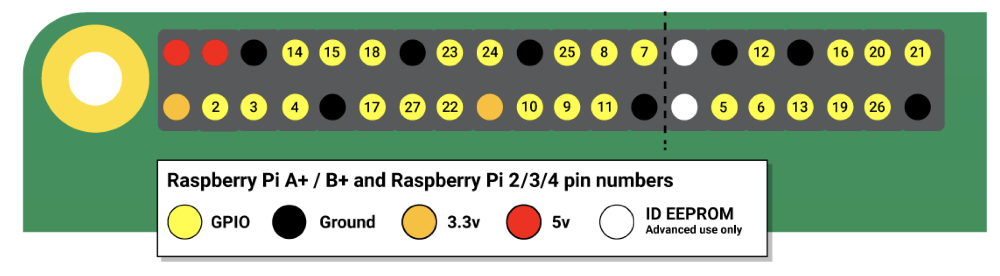

# Project Report - GPIO Week 2

## Workload Division

- Team members: 

  ​					李炳楠 libn@shanghaitech.edu.cn

  ​					秦一帆 qinyf1@shanghaitech.edu.cn

  ​					陈溯汀 chenst@shanghaitech.edu.cn

- Workload division:

  ​					李炳楠：Further improving State.py; Clearify the process; Optimize Fr24Crawler

  ​					秦一帆：Figure out the reason why the demo is being run automatically; Design PWM (controller.py)(important!)

  ​					陈溯汀：Find the basis of light controller; Write report; debug for `controller.py`

## Preliminary Comment

- Online resources: 
  1. https://blog.csdn.net/weixin_34055910/article/details/91842518
  2. https://jingyan.baidu.com/article/a3aad71a9d5c33f1fb0096eb.html
  3. https://requests.readthedocs.io/zh_CN/latest/user/quickstart.html#id5
  4. https://www.zhihu.com/question/273507065
  
- Offline resources:
  
  1. Eric Matthes (2016, July). Python Crash Course: A Hands-on, Project-Based Introduction to Programming. No Starch Press, p.172~179
  
- Please describe the difficulties you encountered in this project;

  Main difficulty: design PWM that's both safe for LED and recongnizable enough.

  As an example:

  > ​    Make the device fade in and out repeatedly.
  >
  > 
  >
  > ​    :param float fade_in_time:
  >
  > ​      Number of seconds to spend fading in. Defaults to 1.
  >
  > 
  >
  > ​    :param float fade_out_time:
  >
  > ​      Number of seconds to spend fading out. Defaults to 1.
  >
  > 
  >
  > ​    :type n: int or None
  >
  > ​    :param n:
  >
  > ​      Number of times to pulse; :data:`None` (the default) means forever.
  >
  > 
  >
  > ​    :param bool background:
  >
  > ​      If :data:`True` (the default), start a background thread to
  >
  > ​      continue pulsing and return immediately. If :data:`False`, only
  >
  > ​      return when the pulse is finished (warning: the default value of
  >
  > ​      *n* will result in this method never returning).

## Control the LED

- Describe how you connect the LED to your Pi. You could answer this question with a diagram of your system;

- What functions or classes did you use to control the LED? 

  FUNCTIONS: 

  ​		Tuple: for basic data processing.

  ​		csv: read csv file easily.

  CLASSES: 

  ​		Fr24Crawler: initiate a web crawler that gather data and store them in a csv file.

  ​				csv: Write data collected from the website into a csv file for storage.

  ​				json: Transfer json files into easy formats like dict and list

  ​				requests: Send requests to URL with a given header to prevent error[451]

  ​				time: Make the interval of gathering data

  ​		BaseController: control LED.

- How did you determine which LED to control in you code when multiple LEDs were presented in the system?

  

  ​	In the picture above, we can see the place where the pin is on. We had chosen pin19, pin26, pin7, pin8 as four digits to perform. With 'BaseController', specific modes can be applied to LED connected to these pins.

  ​	At last, by comparing the status of LED with the numbers printed, whether the output is right can be proven: 

  > density1 = int(self.density / 0.04)
  > if density1 >= 625:
  >     density1 = 624
  > light_pin7 = ((density1 // 5) // 5) // 5
  > light_pin8 = ((density1 // 5) // 5) % 5
  > light_pin19 = (density1 // 5) % 5
  > light_pin26 = density1 % 5
  > print("answer:"+str(light_pin7)+str(light_pin8)+str(light_pin19)+str(light_pin26))   

## Integration with the Crawler

- What did you implement in `state.py` so that the behavior of the class could be observed when running `state.py` directly while importing anything from the file would not cause the demo to be run?

  >**if** __ name __ == "__ main __":
  >
  >  a = State()

  ​	By using this statement, it can be decided whether  `state.py` is being imported, it would have 'Fr24Crawler' safely imported without running automatically.